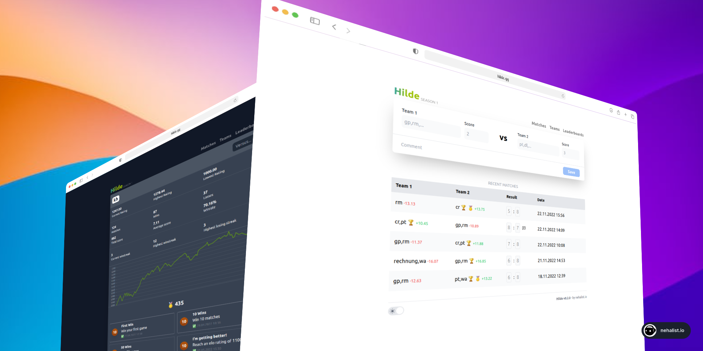

# Hilde 🏆


You've got a foosball table or similar in your office and want to track your matches, player progress and compare yourself to your
colleagues and see who's the best? You've come to the right place.
**Hilde** is a match tracking app for games like foosball, table tennis, air hockey, etc. with achievements, elo ratings, statistics and
more. **Hilde** is easy to setup and can be used by everyone.

A public **demo** is available at [demo.hilde.gg](https://demo.hilde.gg).



## Table of Contents

1. [Features](#features) - Hilde's features
2. [Getting Started](#getting-started) - How to get Hilde up and running
3. [Usage](#usage) - Command line utilities and configuration variables
4. [Contributing](#contributing) - How to contribute
5. [License](#license)

## ⚡️ Features

- Simple, intuitive interface
- **Elo rating** for each team
- **Seasons** (managable via admin interface)
- Detailed team statistics (winstreaks, winrate, elo history chart, ...)
- **Achievements** (e.g. "Win 100 Matches", "Win 10 Matches in a row", ...)
- Compare teams against each other
- Teams of any size, simply separated by a comma in the team name
- **Light/Dark theme**
- Match comments
- **Leaderboards**
- *Optional*: Deployable for free with Vercel & Supabase
- *Optional*: Fully dockerized

## ⭐ Getting Started

Hilde can be installed in a few minutes, either by deploying it to Vercel, using Docker or setting it up manually.

Requirements:

- Node 14+
- PostgreSQL (via [Supabase](https://supabase.com) or local Docker)

Keep in mind that after installing you need to add a season via the admin ui (`/admin`) using the password from the environment variable (`ADMIN_PASSWORD`).

See **[SUPABASE.md](./SUPABASE.md)** for full Supabase + Vercel setup.

### Free hosting with Vercel & Supabase

Hilde can be hosted for free using [Vercel](https://vercel.com) for hosting and [Supabase](https://supabase.com) for PostgreSQL.

[](https://vercel.com/new/clone?repository-url=https%3A%2F%2Fgithub.com%2Fnehalist%2Fhilde)

### Docker Compose (local PostgreSQL)

```bash
docker-compose up -d   # starts PostgreSQL on localhost:5432
cp .env.example .env
npm run migrate
npm run dev
```

### Manually (for development)

1. Clone/fork the repository
2. Run `npm ci` to install dependencies
3. Run `docker-compose up -d` in order to start the database container (or adjust the `.env` file to use a different db)
4. Run `npm run dev` to start the development server
5. Add awesome features.

### Docker

The official Docker image of Hilde is available on [Docker Hub](https://hub.docker.com/repository/docker/nehalist/hilde). Run it locally
via:

1. Run `docker run -p 127.0.0.1:3000:3000 -e DATABASE_URL=postgresql://<user>:<password>@<host>:<port>/<db> -e DIRECT_URL=... nehalist/hilde`
2. Open `http://localhost:3000`
3. Done.

## ⚙️ Usage

### Administration

Hilde provides an admin ui at `/admin` which can be used to manage seasons.

### Commands

Hilde provides a set of utility terminal commands:

| Command           | Description                   |
|-------------------|-------------------------------|
| `npm run dev`     | Starts the development server |
| `npm run build`   | Builds the app                |
| `npm run start`   | Starts the production server  |
| `npm run lint`    | Lints files                   |
| `npm run migrate` | Executes Prisma migrations    |

### Configuration

Hilde can be configured via environment variables in the `.env` file.

| Variable          | Description                          | Example |
|-------------------|--------------------------------------|---------|
| `ADMIN_PASSWORD`  | Administration password              | `change-me` |
| `NEXTAUTH_SECRET` | Token secret                         | random string |
| `NEXTAUTH_URL`    | Deployed URL of Hilde                | `http://localhost:3000` |
| `DATABASE_URL`    | PostgreSQL pooler connection         | Supabase Transaction (6543) |
| `DIRECT_URL`      | PostgreSQL direct connection         | Supabase Session (5432) |

## 👐 Contributing

Hilde was created for fun and to play around with technologies I don't use on a daily basis in my office job, hence can be improved by many ways.

It's built on:

- [Next.js 13](https://nextjs.org/)
- [tRPC](https://trpc.io/)
- [Tailwind CSS](https://tailwindcss.com/)
- [TypeScript](https://www.typescriptlang.org/)
- [Prisma](https://www.prisma.io/)
- [NextAuth.js](https://next-auth.js.org/)
- and many more (see [package.json](package.json))

PRs are highly appreciated 🥳

If you like Hilde, please consider starring the repository. Thanks!

## License

Developed by [nehalist.io](https://nehalist.io). Licensed under the [MIT License](LICENSE).
